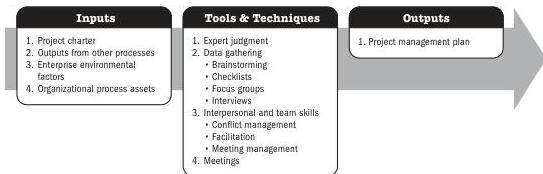
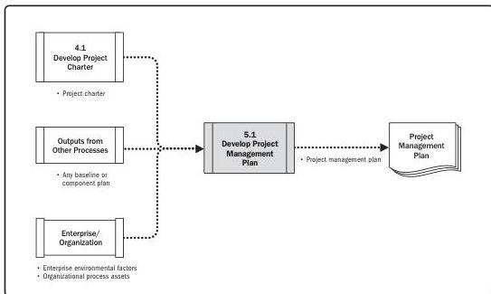

## Develop Project Management Plan

Note: This figure provides the inputs, tools and techniques, and outputs that may be used for this process. Descriptions for inputs and outputs appear in Section 9. Descriptions for tools and techniques appear in Section 10.

**Figure 5-1. Develop Project Management Plan: Inputs, Tools & Techniques, and Outputs**

Note: This figure provides the inputs and outputs that may be used for this process. Descriptions for inputs and outputs appear in Section 9.

**Figure 5-2. Develop Project Management Plan: Data Flow Diagram**

Planning Process Group

PMI Member benefit licensed to: Segun Fatoki - 4510107. Not for distribution, sale, or reproduction.

79