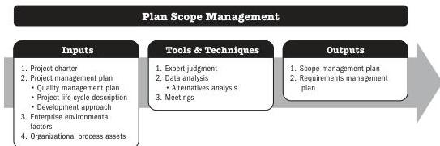

## 5.2 PLAN SCOPE MANAGEMENT

Plan Scope Management is the process of creating a scope management plan that documents how the project and product scope will be defined, validated, and controlled. The key benefit of this process is that it provides guidance and direction on how scope will be managed throughout the project.

*This process is performed once or at predefined points in the project.* The inputs, tools and techniques, and outputs are shown in in Figure 5-3. Figure 5-4 presents the data flow diagram for this process.

Note: This figure provides the inputs, tools and techniques, and outputs that may be used for this process. Descriptions for inputs and outputs appear in Section 9. Descriptions for tools and techniques appear in Section 10.

**Figure 5-3. Plan Scope Management: Inputs, Tools & Techniques, and Outputs**

Planning Process Group

PMI Member benefit licensed to: Segun Fatoki - 4510107. Not for distribution, sale, or reproduction.

81