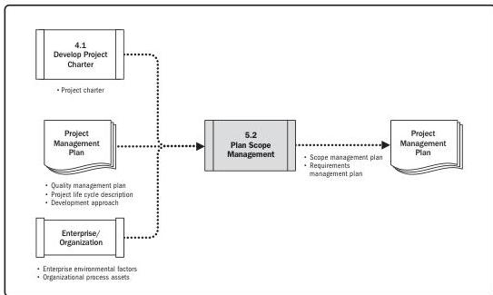

Note: This figure provides the inputs and outputs that may be used for this process.
Descriptions for inputs and outputs appear in Section 9.

**Figure 5-4. Plan Scope Management: Data Flow Diagram**

The scope management plan is a component of the project or program management plan that describes how the scope will be defined, developed, monitored, controlled, and validated. The development of the scope management plan and the detailing of the project scope begin with the analysis of information contained in the project charter, the latest approved subsidiary plans of the project management plan, historical information contained in the organizational process assets, and any other relevant enterprise environmental factors.

82

Process Groups: A Practice Guide

PMI Member benefit licensed to: Segun Fatoki - 4510107. Not for distribution, sale, or reproduction.