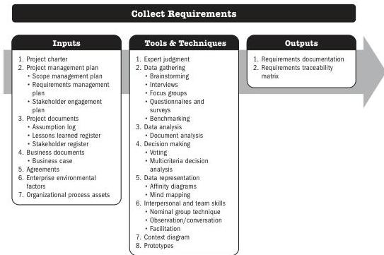

## 5.3 COLLECT REQUIREMENTS

Collect Requirements is the process of determining, documenting, and managing stakeholder needs and requirements to meet objectives. The key benefit of this process is that it provides the basis for defining the product scope and project scope.

*This process is performed once or at predefined points in the project.* The inputs, tools and techniques, and outputs are shown in Figure 5-5. Figure 5-6 presents the data flow diagram for this process.

Note: This figure provides the inputs, tools and techniques, and outputs that may be used for this process. Descriptions for inputs and outputs appear in Section 9. Descriptions for tools and techniques appear in Section 10.

**Figure 5-5. Collect Requirements: Inputs, Tools & Techniques, and Outputs**

Planning Process Group

PMI Member benefit licensed to: Segun Fatoki - 4510107. Not for distribution, sale, or reproduction.

83