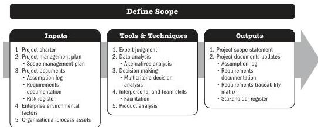

This practice guide does not specifically address product requirements since those are industry specific. Note that *Business Analysis for Practitioners: A Practice Guide* [3] provides more in-depth information about product requirements. A project's success is directly influenced by active stakeholder involvement in the discovery and decomposition of needs into project and product requirements and by the care taken in determining, documenting, and managing the requirements of the product, service, or result of the project. Requirements include conditions or capabilities that are required to be present in a product, service, or result to satisfy an agreement or other formally imposed specification. Requirements include the quantified and documented needs and expectations of the sponsor, customer, and other stakeholders. These requirements need to be elicited, analyzed, and recorded in enough detail to be included in the scope baseline and to be measured once project execution begins. Requirements become the foundation of the work breakdown structure (WBS). Cost, schedule, quality planning, and procurement are all based on these requirements.

## 5.4 DEFINE SCOPE

Define Scope is the process of developing a detailed description of the project and product. The key benefit of this process is that it describes the product, service, or result boundaries and acceptance criteria.

*This process is performed once or at predefined points in the project.* The inputs, tools and techniques, and outputs are shown in Figure 5-7. Figure 5-8 presents the data flow diagram for this process.

Note: This figure provides the inputs, tools and techniques, and outputs that may be used for this process. Descriptions for inputs and outputs appear in Section 9. Descriptions for tools and techniques appear in Section 10.

**Figure 5-7. Define Scope: Inputs, Tools & Techniques, and Outputs**

Planning Process Group

PMI Member benefit licensed to: Segun Fatoki - 4510107. Not for distribution, sale, or reproduction.

85