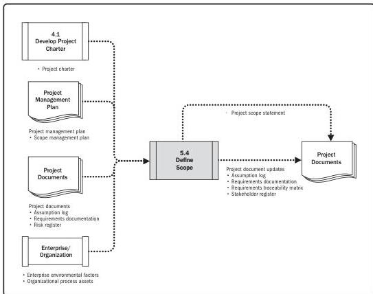

Note: This figure provides the inputs and outputs that may be used for this process.
Descriptions for inputs and outputs appear in Section 9.

**Figure 5-8. Define Scope: Data Flow Diagram**

Since all of the requirements identified in Collect Requirements may not be included in the project, the Define Scope process results in the selection of the final project requirements from the requirements documentation developed during the Collect Requirements process. It then develops a detailed description of the project and product, service, or result.

86

Process Groups: A Practice Guide

PMI Member benefit licensed to: Segun Fatoki - 4510107. Not for distribution, sale, or reproduction.