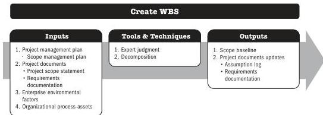

The preparation of a detailed project scope statement builds upon the high-level project description that is documented during project initiation. During project planning, the project scope is defined and described with greater specificity as more information about the project is known. Existing risks, assumptions, and constraints are analyzed for completeness and added or updated as necessary. The Define Scope process can be highly iterative. In iterative life cycle projects, a high-level vision will be developed for the overall project, but the detailed scope is determined one iteration at a time, and the detailed planning for the next iteration is carried out as work progresses on the current project scope and deliverables.

## 5.5 CREATE WBS

Create WBS is the process of subdividing project deliverables and project work into smaller, more manageable components. The key benefit of this process is that it provides a framework of what has to be delivered.

*This process is performed once or at predefined points in the project.* The inputs, tools and techniques, and outputs are shown in Figure 5-9. Figure 5-10 presents the data flow diagram for this process.

Note: This figure provides the inputs, tools and techniques, and outputs that may be used for this process. Descriptions for inputs and outputs appear in Section 9. Descriptions for tools and techniques appear in Section 10.

**Figure 5-9. Create WBS: Inputs, Tools & Techniques, and Outputs**

Planning Process Group

PMI Member benefit licensed to: Segun Fatoki - 4510107. Not for distribution, sale, or reproduction.

87