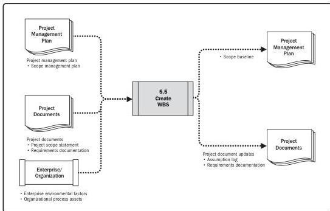

Note: This figure provides the inputs and outputs that may be used for this process.
Descriptions for inputs and outputs appear in Section 9.

**Figure 5-10. Create WBS: Data Flow Diagram**

The WBS is a hierarchical decomposition of the total scope of work to be carried out by the project team to accomplish the project objectives and create the required deliverables. The WBS organizes and defines the total scope of the project and represents the work specified in the current approved project scope statement.

The planned work is contained within the lowest level of WBS components, which are called work packages. A work package can be used to group the activities where work is scheduled and estimated, monitored, and controlled. In the context of the WBS, work refers to work products or deliverables that are the result of activity and not to the activity itself.

88

Process Groups: A Practice Guide

PMI Member benefit licensed to: Segun Fatoki - 4510107. Not for distribution, sale, or reproduction.