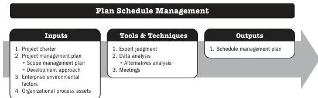

## 5.6 PLAN SCHEDULE MANAGEMENT

Plan Schedule Management is the process of establishing the policies, procedures, and documentation for planning, developing, managing, executing, and controlling the project schedule. The key benefit of this process is that it provides guidance and direction on how the project schedule will be managed throughout the project.

*This process is performed once or at predefined points in the project.* The inputs, tools and techniques, and outputs are shown in Figure 5-11. Figure 5-12 presents the data flow diagram for this process.

Note: This figure provides the inputs, tools and techniques, and outputs that may be used for this process. Descriptions for inputs and outputs appear in Section 9. Descriptions for tools and techniques appear in Section 10.

**Figure 5-11. Plan Schedule Management: Inputs, Tools & Techniques, and Outputs**

Planning Process Group

PMI Member benefit licensed to: Segun Fatoki - 4510107. Not for distribution, sale, or reproduction.

89