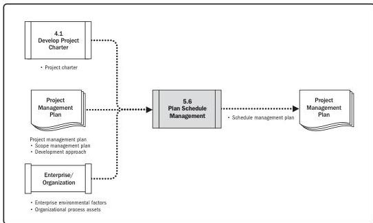

Note: This figure provides the inputs and outputs that may be used for this process.
Descriptions for inputs and outputs appear in Section 9.

Figure 5-12. Plan Schedule Management: Data Flow Diagram

## 5.7 DEFINE ACTIVITIES

Define Activities is the process of identifying and documenting the specific actions to be performed to produce the project deliverables. The key benefit of this process is that it decomposes work packages into schedule activities that provide a basis for estimating, scheduling, executing, monitoring, and controlling the project work.

This process is performed throughout the project. The inputs, tools and techniques, and outputs are shown in Figure 5-13. Figure 5-14 presents the data flow diagram for this process.

90

Process Groups: A Practice Guide

PMI Member benefit licensed to: Segun Fatoki - 4510107. Not for distribution, sale, or reproduction.