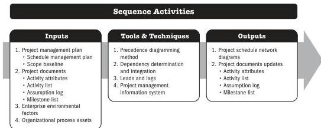

## 5.8 SEQUENCE ACTIVITIES

Sequence Activities is the process of identifying and documenting relationships among the project activities. The key benefit of this process is that it defines the logical sequence of work to obtain the greatest efficiency given all project constraints.

*This process is performed throughout the project.* The inputs, tools and techniques, and outputs are shown in Figure 5-15. Figure 5-16 presents the data flow diagram for this process.

Note: This figure provides the inputs, tools and techniques, and outputs that may be used for this process. Descriptions for inputs and outputs appear in Section 9. Descriptions for tools and techniques appear in Section 10.

**Figure 5-15. Sequence Activities: Inputs, Tools & Techniques, and Outputs**

92

Process Groups: A Practice Guide

PMI Member benefit licensed to: Segun Fatoki - 4510107. Not for distribution, sale, or reproduction.