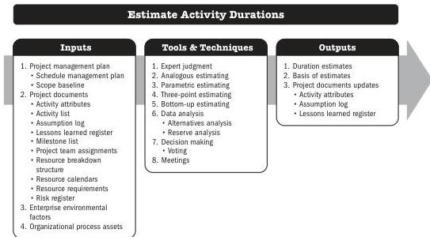

## 5.9 ESTIMATE ACTIVITY DURATIONS

Estimate Activity Durations is the process of estimating the number of work periods needed to complete individual activities with estimated resources. The key benefit of this process is that it provides the amount of time each activity will take to complete.

*This process is performed throughout the project.* The inputs, tools and techniques, and outputs are shown in Figure 5-17. Figure 5-18 presents the data flow diagram for this process.

Note: This figure provides the inputs, tools and techniques, and outputs that may be used for this process. Descriptions for inputs and outputs appear in Section 9. Descriptions for tools and techniques appear in Section 10.

**Figure 5-17. Estimate Activity Durations: Inputs, Tools & Techniques, and Outputs**

94

Process Groups: A Practice Guide

PMI Member benefit licensed to: Segun Fatoki - 4510107. Not for distribution, sale, or reproduction.