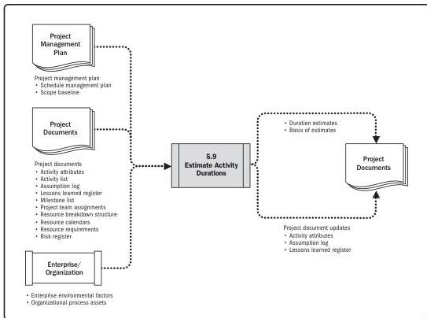

Note: This figure provides the inputs and outputs that may be used for this process.
Descriptions for inputs and outputs appear in Section 9.

**Figure 5-18. Estimate Activity Durations: Data Flow Diagram**

Estimating activity durations uses information from the scope of work, required resource types or skill levels, estimated resource quantities, and resource calendars. Other factors that may influence the duration estimates include constraints imposed on the duration, effort involved, or type of resources (e.g., fixed duration, fixed effort or work, fixed number of resources), as well as the schedule network analysis technique used. The inputs for the estimates of duration originate from the person or group on the project team who is most familiar with the nature of the work in the specific activity. The duration estimate is progressively elaborated, and the process considers the quality and availability of the input data. For example, as more detailed and precise data are available about the project engineering and design work, the accuracy and quality of the duration estimates improve.

Planning Process Group

PMI Member benefit licensed to: Segun Fatoki - 4510107. Not for distribution, sale, or reproduction.

95