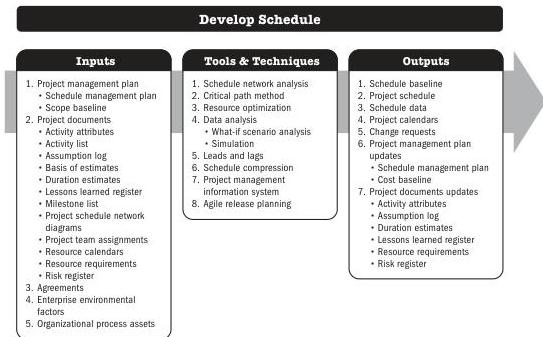

## 5.10 DEVELOP SCHEDULE

Develop Schedule is the process of analyzing activity sequences, durations, resource requirements, and schedule constraints to create a schedule model for project execution and monitoring and controlling. The key benefit of this process is that it generates a schedule model with planned dates for completing project activities.

*This process is performed throughout the project.* The inputs, tools and techniques, and outputs are shown in Figure 5-19. Figure 5-20 presents the data flow diagram for this process.

Note: This figure provides the inputs, tools and techniques, and outputs that may be used for this process. Descriptions for inputs and outputs appear in Section 9. Descriptions for tools and techniques appear in Section 10.

**Figure 5-19. Develop Schedule: Inputs, Tools & Techniques, and Outputs**

Planning Process Group

PMI Member benefit licensed to: Segun Fatoki - 4510107. Not for distribution, sale, or reproduction.

97