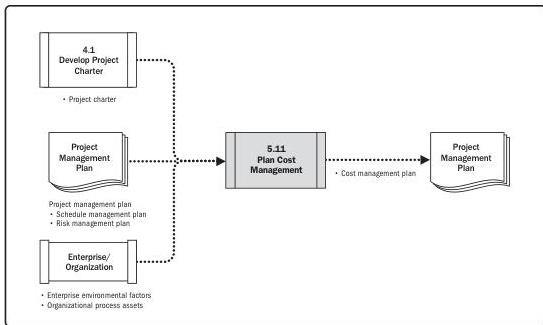

Note: This figure provides the inputs and outputs that may be used for this process.
Descriptions for inputs and outputs appear in Section 9.

**Figure 5-22. Plan Cost Management: Data Flow Diagram**

The cost management planning effort occurs early in project planning and sets the framework for each of the cost management processes so that performance of the processes will be efficient and coordinated. The cost management processes and their associated tools and techniques are documented in the cost management plan. The cost management plan is a component of the project management plan.

## 5.12 ESTIMATE COSTS

Estimate Costs is the process of developing an approximation of the cost of resources needed to complete project work. The key benefit of this process is that it determines the monetary resources required for the project.

*This process is performed periodically throughout the project as needed.* The inputs, tools and techniques, and outputs are shown in Figure 5-23. Figure 5-24 presents the data flow diagram for this process.

100

Process Groups: A Practice Guide

PMI Member benefit licensed to: Segun Fatoki - 4510107. Not for distribution, sale, or reproduction.