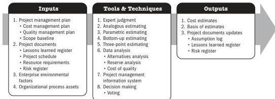
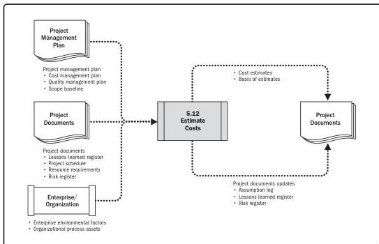

## Estimate Costs

Note: This figure provides the inputs, tools and techniques, and outputs that may be used for this process. Descriptions for inputs and outputs appear in Section 9. Descriptions for tools and techniques appear in Section 10.

Figure 5-23. Estimate Costs: Inputs, Tools & Techniques, and Outputs

Note: This figure provides the inputs and outputs that may be used for this process. Descriptions for inputs and outputs appear in Section 9.

Figure 5-24. Estimate Costs: Data Flow Diagram

Planning Process Group

101

PMI Member benefit licensed to: Segun Fatoki - 4510107. Not for distribution, sale, or reproduction.