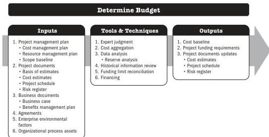

## 5.13 DETERMINE BUDGET

Determine Budget is the process of aggregating the estimated costs of individual activities or work packages to establish an authorized cost baseline. The key benefit of this process is that it determines the cost baseline against which project performance can be monitored and controlled.

*This process is performed once or at predefined points in the project.* The inputs, tools and techniques, and outputs are shown in Figure 5-25. Figure 5-26 presents the data flow diagram for this process.

A project budget includes all of the funds authorized to execute the project. The cost baseline is the approved version of the time-phased project budget that includes contingency reserves but excludes management reserves.

Note: This figure provides the inputs, tools and techniques, and outputs that may be used for this process. Descriptions for inputs and outputs appear in Section 9. Descriptions for tools and techniques appear in Section 10.

**Figure 5-25. Determine Budget: Inputs, Tools & Techniques, and Outputs**

Planning Process Group

PMI Member benefit licensed to: Segun Fatoki - 4510107. Not for distribution, sale, or reproduction.

103