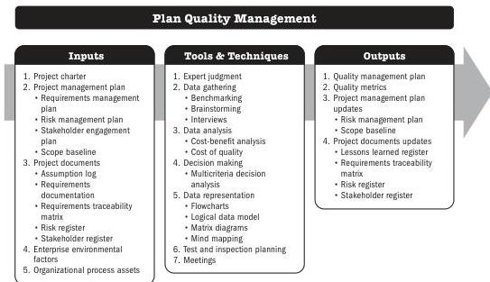

## 5.14 PLAN QUALITY MANAGEMENT

Plan Quality Management is the process of identifying quality requirements and/or standards for the project and its deliverables. This process documents how the project will demonstrate compliance with quality requirements and/or standards. The key benefit of this process is that it provides guidance and direction on how quality will be managed and verified throughout the project.

*This process is performed once or at predefined points in the project.* The inputs, tools and techniques, and outputs are shown in Figure 5-27. Figure 5-28 presents the data flow diagram for this process.

Note: This figure provides the inputs, tools and techniques, and outputs that may be used for this process. Descriptions for inputs and outputs appear in Section 9. Descriptions for tools and techniques appear in Section 10.

**Figure 5-27. Plan Quality Management: Inputs, Tools & Techniques, and Outputs**

Planning Process Group

PMI Member benefit licensed to: Segun Fatoki - 4510107. Not for distribution, sale, or reproduction.

105