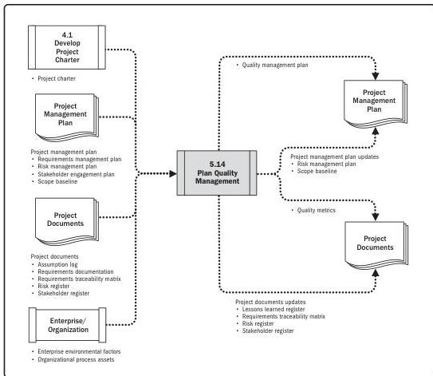

Note: This figure provides the inputs and outputs that may be used for this process.
Descriptions for inputs and outputs appear in Section 9.

**Figure 5-28. Plan Quality Management: Data Flow Diagram**

Quality planning should be performed in parallel with the other planning processes. For example, changes proposed in the deliverables in order to meet identified quality standards may require cost or schedule adjustments and a detailed risk analysis of the impact to plans.

The quality planning techniques discussed here are those used most frequently on projects. There are many others that may be useful on certain projects or in specific application areas.

106

Process Groups: A Practice Guide

PMI Member benefit licensed to: Segun Fatoki - 4510107. Not for distribution, sale, or reproduction.