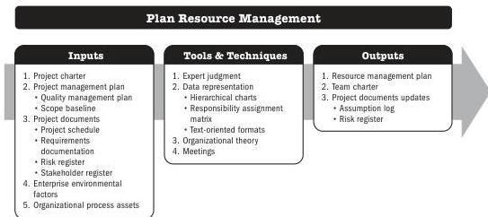

## 5.15 PLAN RESOURCE MANAGEMENT

Plan Resource Management is the process of defining how to estimate, acquire, manage, and use team and physical resources. The key benefit of this process is that it establishes the approach and level of management effort needed for managing project resources based on the type and complexity of the project.

*This process is performed once or at predefined points in the project.* The inputs, tools and techniques, and outputs are shown in Figure 5-29. Figure 5-30 presents the data flow diagram for this process.

Note: This figure provides the inputs, tools and techniques, and outputs that may be used for this process. Descriptions for inputs and outputs appear in Section 9. Descriptions for tools and techniques appear in Section 10.

**Figure 5-29. Plan Resource Management: Inputs, Tools & Techniques, and Outputs**

Planning Process Group

PMI Member benefit licensed to: Segun Fatoki - 4510107. Not for distribution, sale, or reproduction.

107