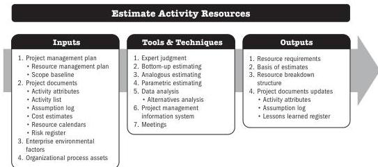

Resource planning is used to determine and identify an approach to ensure that sufficient resources are available for the successful completion of the project. Project resources may include team members, supplies, materials, equipment, services, and facilities. Effective resource planning should consider and plan for the availability of, or competition for, scarce resources.

## 5.16 ESTIMATE ACTIVITY RESOURCES

Estimate Activity Resources is the process of estimating team resources and the type and quantities of materials, equipment, and supplies necessary to perform project work. The key benefit of this process is that it identifies the type, quantity, and characteristics of resources required to complete the project.

*This process is performed periodically throughout the project as needed.* The inputs, tools and techniques, and outputs are shown in Figure 5-31. Figure 5-32 presents the data flow diagram for this process.

Project resources can be obtained from the organization's internal assets or from outside the organization through a procurement process. Other projects may be competing for the same resources required for the project at the same time and location. This may significantly impact project costs, schedules, risks, quality, and other project areas.

Note: This figure provides the inputs, tools and techniques, and outputs that may be used for this process. Descriptions for inputs and outputs appear in Section 9. Descriptions for tools and techniques appear in Section 10.

Figure 5-31. Estimate Activity Resources: Inputs, Tools & Techniques, and Outputs

Planning Process Group

PMI Member benefit licensed to: Segun Fatoki - 4510107. Not for distribution, sale, or reproduction.

109