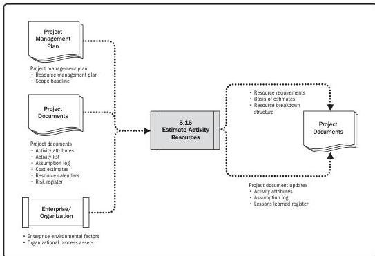

Note: This figure provides the inputs and outputs that may be used for this process.
Descriptions for inputs and outputs appear in Section 9.

**Figure 5-32. Estimate Activity Resources: Data Flow Diagram**

The Estimate Activity Resources process is closely coordinated with other processes, such as the Estimate Costs process. For example:

- ▶ A construction project team will need to be familiar with local building codes. Such knowledge is often readily available from local sellers. If the internal labor pool lacks experience with unusual or specialized construction techniques, the additional cost for a consultant may be the most effective way to secure knowledge of the local building codes.
- ▶ An automotive design team will need to be familiar with the latest automated assembly techniques. The requisite knowledge could be obtained by hiring a consultant, by sending a designer to a seminar on robotics, or by including someone from manufacturing as a member of the project team.

110

Process Groups: A Practice Guide

PMI Member benefit licensed to: Segun Fatoki - 4510107. Not for distribution, sale, or reproduction.