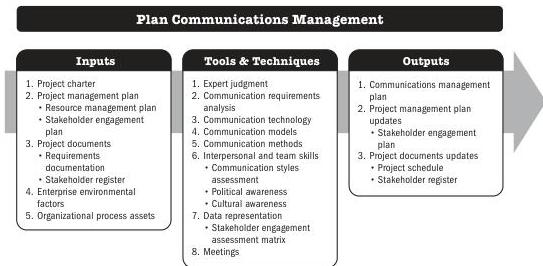

## 5.17 PLAN COMMUNICATIONS MANAGEMENT

Plan Communications Management is the process of developing an appropriate approach and plan for project communications activities based on the information needs of each stakeholder or group, available organizational assets, and the needs of the project. The key benefit of this process is a documented approach to effectively and efficiently engage stakeholders by presenting relevant information in a timely manner.

*This process is performed periodically throughout the project as needed.* The inputs, tools and techniques, and outputs are shown in Figure 5-33. Figure 5-34 presents the data flow diagram for the process.

Note: This figure provides the inputs, tools and techniques, and outputs that may be used for this process. Descriptions for inputs and outputs appear in Section 9. Descriptions for tools and techniques appear in Section 10.

**Figure 5-33. Plan Communications Management: Inputs, Tools & Techniques, and Outputs**

Planning Process Group

PMI Member benefit licensed to: Segun Fatoki - 4510107. Not for distribution, sale, or reproduction.

111