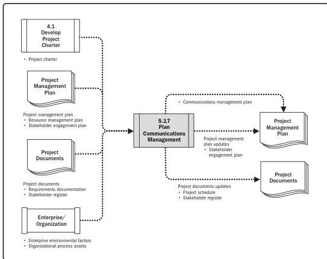

Note: This figure provides the inputs and outputs that may be used for this process.
Descriptions for inputs and outputs appear in Section 9.

**Figure 5-34. Plan Communications Management: Data Flow Diagram**

An effective communications management plan that recognizes the diverse information needs of the project's stakeholders is developed early in the project life cycle. It should be reviewed regularly and modified when necessary, when the stakeholder community changes or at the start of each new project phase.

On most projects, communications planning is performed very early, during stakeholder identification and project management plan development.

112

Process Groups: A Practice Guide

PMI Member benefit licensed to: Segun Fatoki - 4510107. Not for distribution, sale, or reproduction.