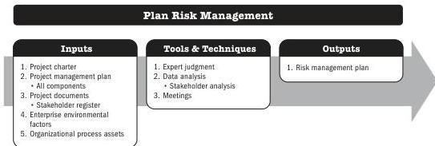

While all projects share the need to communicate project information, the information needs and methods of distribution may vary widely. In addition, the methods of storage, retrieval, and ultimate disposition of the project information need to be considered and documented during this process. The results of the Plan Communications Management process should be reviewed regularly throughout the project and revised as needed to ensure continued applicability

## 5.18 PLAN RISK MANAGEMENT

Plan Risk Management is the process of defining how to conduct risk management activities for a project. The key benefit of this process is that it ensures that the degree, type, and visibility of risk management are proportionate to both risks and the importance of the project to the organization and other stakeholders.

*This process is performed once or at predefined points in the project.* The inputs, tools and techniques, and outputs are shown in Figure 5-35. Figure 5-36 presents the data flow diagram for this process.

Note: This figure provides the inputs, tools and techniques, and outputs that may be used for this process. Descriptions for inputs and outputs appear in Section 9. Descriptions for tools and techniques appear in Section 10.

**Figure 5-35. Plan Risk Management: Inputs, Tools & Techniques, and Outputs**

Planning Process Group

PMI Member benefit licensed to: Segun Fatoki - 4510107. Not for distribution, sale, or reproduction.

113