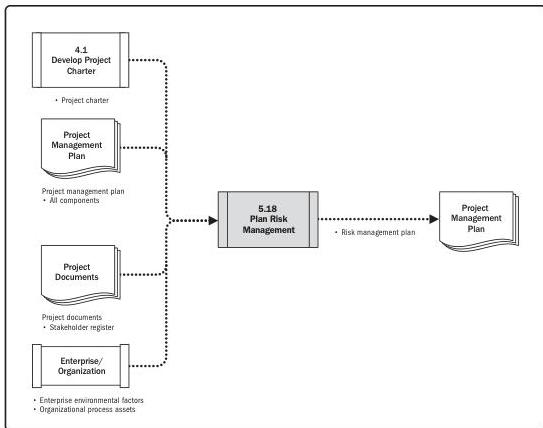

Note: This figure provides the inputs and outputs that may be used for this process.
Descriptions for inputs and outputs appear in Section 9.

**Figure 5-36. Plan Risk Management: Data Flow Diagram**

The Plan Risk Management process should begin when a project is conceived and should be completed early in the project. It may be necessary to revisit this process later in the project life cycle, for example at a major phase change, if the project scope changes significantly, or if a subsequent review of risk management effectiveness determines that the Plan Risk Management process requires modification.

114

Process Groups: A Practice Guide

PMI Member benefit licensed to: Segun Fatoki - 4510107. Not for distribution, sale, or reproduction.