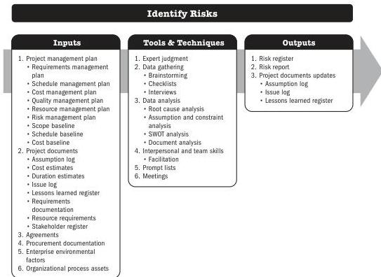

## 5.19 IDENTIFY RISKS

Identify Risks is the process of identifying individual project risks as well as sources of overall project risk and documenting their characteristics. The key benefit of this process is the documentation of existing individual project risks and the sources of overall project risk. It also brings together information so the project team can respond appropriately to identified risks.

*This process is performed throughout the project.* The inputs, tools and techniques, and outputs are shown in Figure 5-37. Figure 5-38 presents the data flow diagram for this process.

Note: This figure provides the inputs, tools and techniques, and outputs that may be used for this process. Descriptions for inputs and outputs appear in Section 9. Descriptions for tools and techniques appear in Section 10.

**Figure 5-37. Identify Risks: Inputs, Tools & Techniques, and Outputs**

Planning Process Group

PMI Member benefit licensed to: Segun Fatoki - 4510107. Not for distribution, sale, or reproduction.

115