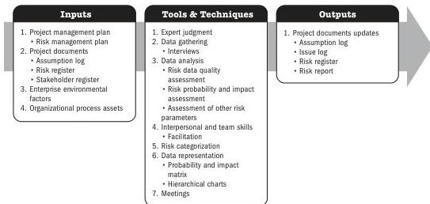
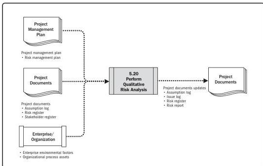

# Perform Qualitative Risk Analysis

Note: This figure provides the inputs, tools and techniques, and outputs that may be used for this process. Descriptions for inputs and outputs appear in Section 9. Descriptions for tools and techniques appear in Section 10.

Figure 5-39. Perform Qualitative Risk Analysis: Inputs, Tools & Techniques, and Outputs

Note: This figure provides the inputs and outputs that may be used for this process. Descriptions for inputs and outputs appear in Section 9.

Figure 5-40. Perform Qualitative Risk Analysis: Data Flow Diagram

118

Process Groups: A Practice Guide

PMI Member benefit licensed to: Segun Fatoki - 4510107. Not for distribution, sale, or reproduction.