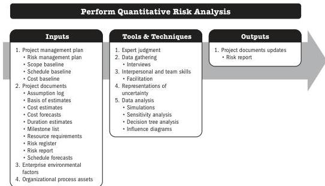

## 5.21 PERFORM QUANTITATIVE RISK ANALYSIS

Perform Quantitative Risk Analysis is the process of numerically analyzing the combined effect of identified individual project risks and other sources of uncertainty on overall project objectives. The key benefit of this process is that it quantifies overall project risk exposure, and it can also provide additional quantitative risk information to support risk response planning.

*This process is not required for every project, but where it is used, it is performed throughout the project.* The inputs and outputs are shown in Figure 5-41. Figure 5-42 presents the data flow diagram for this process.

Note: This figure provides the inputs, tools and techniques, and outputs that may be used for this process. Descriptions for inputs and outputs appear in Section 9. Descriptions for tools and techniques appear in Section 10.

**Figure 5-41. Perform Quantitative Risk Analysis: Inputs, Tools & Techniques, and Outputs**

120

Process Groups: A Practice Guide

PMI Member benefit licensed to: Segun Fatoki - 4510107. Not for distribution, sale, or reproduction.