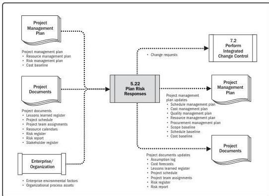

Note: This figure provides the inputs and outputs that may be used for this process.
Descriptions for inputs and outputs appear in Section 9.

**Figure 5-44. Plan Risk Responses: Data Flow Diagram**

Effective and appropriate risk responses can minimize individual threats, maximize individual opportunities, and reduce overall project risk exposure. Unsuitable risk responses can have the converse effect. Once risks have been identified, analyzed, and prioritized, plans should be developed by the nominated risk owner for addressing every individual project risk the project team considers to be sufficiently important, either because of the threat it poses to the project objectives or the opportunity it offers. The project manager should also consider how to respond appropriately to the current level of overall project risk.

124

Process Groups: A Practice Guide

PMI Member benefit licensed to: Segun Fatoki - 4510107. Not for distribution, sale, or reproduction.