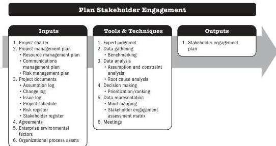

## 5.24 PLAN STAKEHOLDER ENGAGEMENT

Plan Stakeholder Engagement is the process of developing approaches to involve project stakeholders based on their needs, expectations, interests, and potential impact on the project. The key benefit is that it provides an actionable plan to interact effectively with stakeholders.

*This process is performed periodically throughout the project as needed.* The inputs, tools and techniques, and outputs are shown in Figure 5-47. Figure 5-48 presents the data flow diagram for this process.

Note: This figure provides the inputs, tools and techniques, and outputs that may be used for this process. Descriptions for inputs and outputs appear in Section 9. Descriptions for tools and techniques appear in Section 10.

**Figure 5-47. Plan Stakeholder Engagement: Inputs, Tools & Techniques, and Outputs**

Planning Process Group

PMI Member benefit licensed to: Segun Fatoki - 4510107. Not for distribution, sale, or reproduction.

129