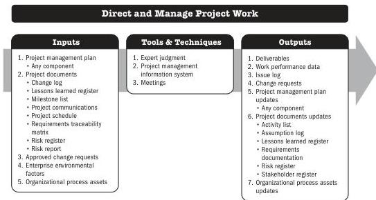

## 6.1 DIRECT AND MANAGE PROJECT WORK

Direct and Manage Project Work is the process of leading and performing the work defined in the project management plan and implementing approved changes to achieve the project's objectives. The key benefit of this process is that it provides overall management of the project work and deliverables, thus improving the probability of project success.

*This process is performed throughout the project.* The inputs, tools and techniques, and outputs are shown in Figure 6-1. Figure 6-2 presents the data flow diagram for this process.

Note: This figure provides the inputs, tools and techniques, and outputs that may be used for this process. Descriptions for inputs and outputs appear in Section 9. Descriptions for tools and techniques appear in Section 10.

**Figure 6-1. Direct and Manage Project Work: Inputs, Tools & Techniques, and Outputs**

134

Process Groups: A Practice Guide

PMI Member benefit licensed to: Segun Fatoki - 4510107. Not for distribution, sale, or reproduction.