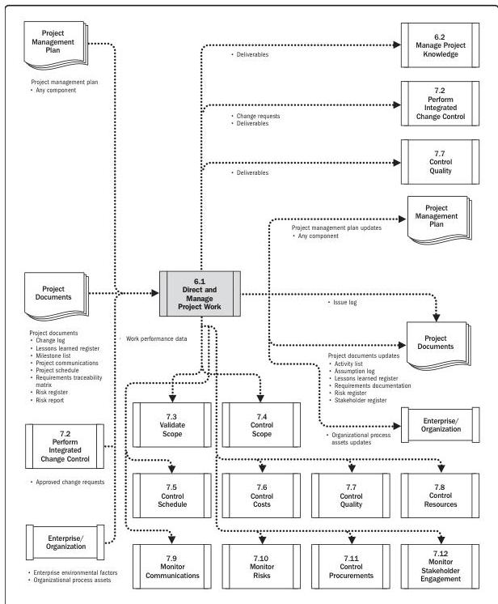

Note: This figure provides the inputs and outputs that may be used for this process.
Descriptions for inputs and outputs appear in Section 9.

Figure 6-2. Direct and Manage Project Work: Data Flow Diagram

Executing Process Group

135

PMI Member benefit licensed to: Segun Fatoki - 4510107. Not for distribution, sale, or reproduction.