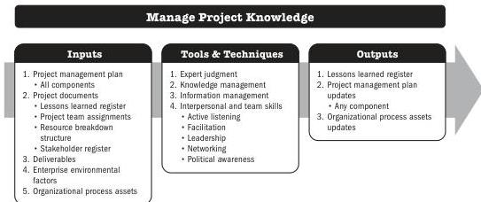

## 6.2 MANAGE PROJECT KNOWLEDGE

Manage Project Knowledge is the process of using existing knowledge and creating new knowledge to achieve the project's objectives and contribute to organizational learning. The key benefits of this process are that prior organizational knowledge is leveraged to produce or improve the project outcomes, and knowledge created by the project is available to support organizational operations and future projects or phases.

*This process is performed throughout the project.* The inputs, tools and techniques, and outputs are shown in Figure 6-3. Figure 6-4 presents the data flow diagram for this process.

Note: This figure provides the inputs, tools and techniques, and outputs that may be used for this process. Descriptions for inputs and outputs appear in Section 9. Descriptions for tools and techniques appear in Section 10.

**Figure 6-3. Manage Project Knowledge: Inputs, Tools & Techniques, and Outputs**

Executing Process Group

PMI Member benefit licensed to: Segun Fatoki - 4510107. Not for distribution, sale, or reproduction.

137