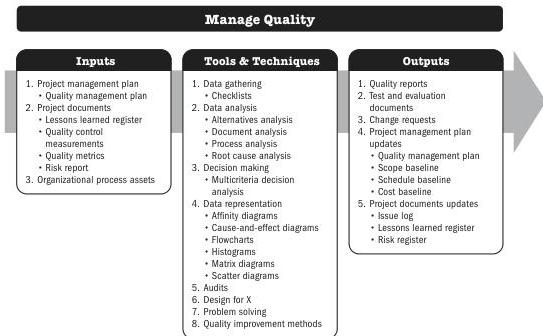

## 6.3 MANAGE QUALITY

Manage Quality is the process of translating the quality management plan into executable quality activities that incorporate the organization's quality policies into the project. The key benefits of this process are that it increases the probability of meeting the quality objectives as well as identifying ineffective processes and causes of poor quality. Manage Quality uses the data and results from the Control Quality process to reflect the overall quality status of the project to the stakeholders.

*This process is performed throughout the project.* The inputs, tools and techniques, and outputs are shown in Figure 6-5. Figure 6-6 presents the data flow diagram for this process.

Note: This figure provides the inputs, tools and techniques, and outputs that may be used for this process. Descriptions for inputs and outputs appear in Section 9. Descriptions for tools and techniques appear in Section 10.

**Figure 6-5. Manage Quality: Inputs, Tools & Techniques, and Outputs**

140

Process Groups: A Practice Guide

PMI Member benefit licensed to: Segun Fatoki - 4510107. Not for distribution, sale, or reproduction.