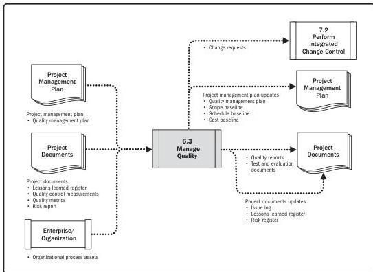

Note: This figure provides the inputs and outputs that may be used for this process.
Descriptions for inputs and outputs appear in Section 9.

**Figure 6-6. Manage Quality: Data Flow Diagram**

Manage Quality is sometimes called quality assurance, although Manage Quality has a broader definition than quality assurance as it is used in non-project work. In project management, the focus of quality assurance is on the processes used in the project. Quality assurance is about using project processes effectively. It involves following and meeting standards to assure stakeholders that the final product will meet their needs, expectations, and requirements. Manage Quality includes all the quality assurance activities and is also concerned with the product design aspects and process improvements. Manage Quality work will fall under the conformance work category in the cost of quality framework.

Executing Process Group

141

PMI Member benefit licensed to: Segun Fatoki - 4510107. Not for distribution, sale, or reproduction.