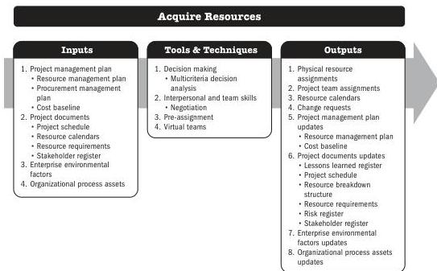

## 6.4 ACQUIRE RESOURCES

Acquire Resources is the process of obtaining team members, facilities, equipment, materials, supplies, and other resources necessary to complete project work. The key benefit of this process is that it outlines and guides the selection of resources and assigns them to their respective activities.

*This process is performed periodically throughout the project as needed.* The inputs, tools and techniques, and outputs are shown in Figure 6-7. Figure 6-8 presents the data flow diagram for this process.

Note: This figure provides the inputs, tools and techniques, and outputs that may be used for this process. Descriptions for inputs and outputs appear in Section 9. Descriptions for tools and techniques appear in Section 10.

**Figure 6-7. Acquire Resources: Inputs, Tools & Techniques, and Outputs**

Executing Process Group

143

PMI Member benefit licensed to: Segun Fatoki - 4510107. Not for distribution, sale, or reproduction.