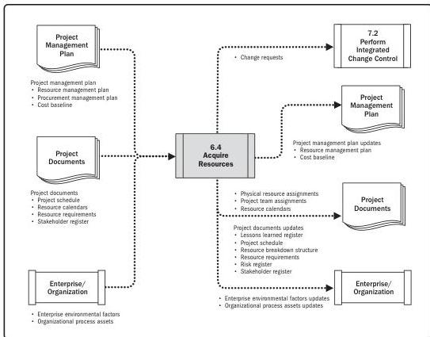

Note: This figure provides the inputs and outputs that may be used for this process.
Descriptions for inputs and outputs appear in Section 9.

**Figure 6-8. Acquire Resources: Data Flow Diagram**

The resources needed for a project can be internal or external to the project-performing organization. Internal resources are acquired (assigned) from functional or resource managers. External resources are acquired through the procurement processes.

The project management team may or may not have direct control over resource selection because of collective bargaining agreements, use of subcontractor personnel, a matrix project environment, internal or external reporting relationships, or other reasons. It is important that the following factors are considered during the process of acquiring the project resources:

144

Process Groups: A Practice Guide

PMI Member benefit licensed to: Segun Fatoki - 4510107. Not for distribution, sale, or reproduction.