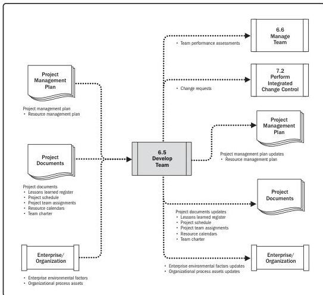

Note: This figure provides the inputs and outputs that may be used for this process.
Descriptions for inputs and outputs appear in Section 9.

**Figure 6-10. Develop Team: Data Flow Diagram**

Project managers require the skills to identify, build, maintain, motivate, lead, and inspire project teams to achieve high team performance and meet the project's objectives. Teamwork is a critical factor for project success. Developing effective project teams is one of the project manager's primary responsibilities.

Executing Process Group

147

PMI Member benefit licensed to: Segun Fatoki - 4510107. Not for distribution, sale, or reproduction.