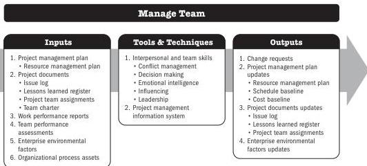

A project manager needs to be sensitive to both the willingness and the ability of team members to perform their work and adjust their management and leadership styles accordingly. Team members with low-skill abilities will require more intensive oversight than those who have demonstrated ability and experience.

## 6.6 MANAGE TEAM

Manage Team is the process of tracking team member performance, providing feedback, resolving issues, and managing team changes to optimize project performance. The key benefit of this process is that it influences team behavior, manages conflict, and resolves issues.

*This process is performed throughout the project.* The inputs, tools and techniques, and outputs are shown in Figure 6-11. Figure 6-12 presents the data flow diagram for this process.

Managing a project team requires a variety of management and leadership skills for fostering teamwork and integrating the efforts of team members to create high-performance teams. Team management involves a combination of skills with special emphasis on communication, conflict management, negotiation, and leadership. Project managers should provide challenging assignments to team members and give recognition for high performance.

Note: This figure provides the inputs, tools and techniques, and outputs that may be used for this process. Descriptions for inputs and outputs appear in Section 9. Descriptions for tools and techniques appear in Section 10.

Figure 6-11. Manage Team: Inputs, Tools & Techniques, and Outputs

150

Process Groups: A Practice Guide

PMI Member benefit licensed to: Segun Fatoki - 4510107. Not for distribution, sale, or reproduction.