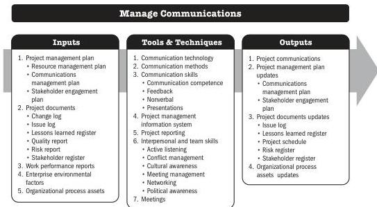

## 6.7 MANAGE COMMUNICATIONS

Manage Communications is the process of ensuring timely and appropriate collection, creation, distribution, storage, retrieval, management, monitoring, and the ultimate disposition of project information. The key benefit of this process is that it enables an efficient and effective information flow between the project team and the stakeholders.

The Manage Communications process identifies all aspects of effective communication, including choice of appropriate technologies, methods, and techniques. In addition, it should allow for flexibility in the communications activities, allowing adjustments in the methods and techniques to accommodate the changing needs of stakeholders and the project.

*This process is performed throughout the project.* The inputs, tools and techniques, and outputs are shown in Figure 6-13. Figure 6-14 presents the data flow diagram for this process.

Note: This figure provides the inputs, tools and techniques, and outputs that may be used for this process. Descriptions for inputs and outputs appear in Section 9. Descriptions for tools and techniques appear in Section 10.

**Figure 6-13. Manage Communications: Inputs, Tools & Techniques, and Outputs**

152

Process Groups: A Practice Guide

PMI Member benefit licensed to: Segun Fatoki - 4510107. Not for distribution, sale, or reproduction.