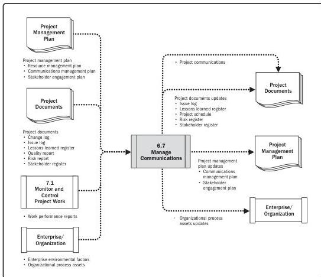

Note: This figure provides the inputs and outputs that may be used for this process.
Descriptions for inputs and outputs appear in Section 9.

**Figure 6-14. Manage Communications: Data Flow Diagram**

This process goes beyond the distribution of relevant information and seeks to ensure that the information being communicated to project stakeholders has been appropriately generated and formatted and received by the intended audience. It also provides opportunities for stakeholders to make requests for further information, clarification, and discussion. Techniques and considerations for effective communications management include but are not limited to:

Executing Process Group

153

PMI Member benefit licensed to: Segun Fatoki - 4510107. Not for distribution, sale, or reproduction.