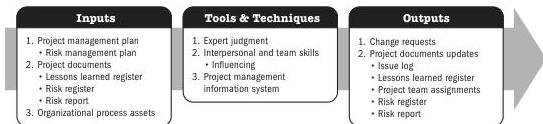
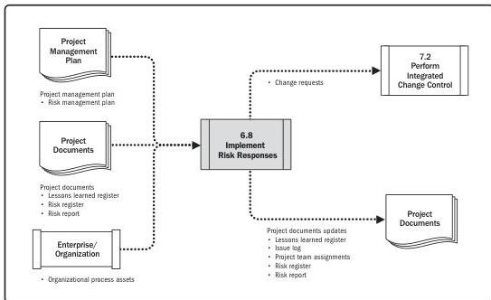

## Implement Risk Responses

Note: This figure provides the inputs, tools and techniques, and outputs that may be used for this process. Descriptions for inputs and outputs appear in Section 9. Descriptions for tools and techniques appear in Section 10.

Figure 6-15. Implement Risk Responses: Inputs, Tools & Techniques, and Outputs

Note: This figure provides the inputs and outputs that may be used for this process. Descriptions for inputs and outputs appear in Section 9.

Figure 6-16. Implement Risk Responses: Data Flow Diagram

Executing Process Group

155

PMI Member benefit licensed to: Segun Fatoki - 4510107. Not for distribution, sale, or reproduction.