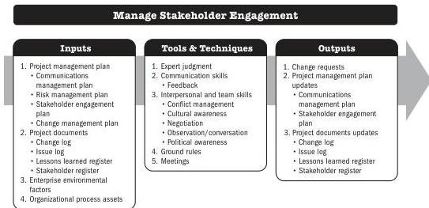

## 6.10 MANAGE STAKEHOLDER ENGAGEMENT

Manage Stakeholder Engagement is the process of communicating and working with stakeholders to meet their needs and expectations, address issues, and foster appropriate stakeholder involvement. The key benefit of this process is that it allows the project manager to increase support and minimize resistance from stakeholders.

*This process is performed throughout the project.* The inputs, tools and techniques, and outputs are shown in Figure 6-19. Figure 6-20 presents the data flow diagram for this process.

Note: This figure provides the inputs, tools and techniques, and outputs that may be used for this process. Descriptions for inputs and outputs appear in Section 9. Descriptions for tools and techniques appear in Section 10.

**Figure 6-19. Manage Stakeholder Engagement: Inputs, Tools & Techniques, and Outputs**

Executing Process Group

159

PMI Member benefit licensed to: Segun Fatoki - 4510107. Not for distribution, sale, or reproduction.