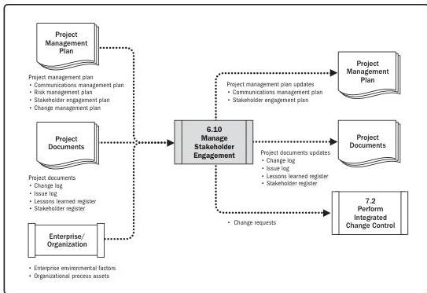

Note: This figure provides the inputs and outputs that may be used for this process.
Descriptions for inputs and outputs appear in Section 9.

**Figure 6-20. Manage Stakeholder Engagement: Data Flow Diagram**

Manage Stakeholder Engagement involves activities such as:

- ▶ Engage stakeholders at appropriate project stages to obtain, confirm, or maintain their continued commitment to the success of the project.
- ▶ Manage stakeholder expectations through negotiation and communication.
- ▶ Address any risks or potential concerns related to stakeholder management and anticipate future issues that may be raised by stakeholders.
- ▶ Clarify and resolve issues that have been identified.

Managing stakeholder engagement helps to ensure that stakeholders clearly understand the project goals, objectives, benefits, and risks for the project, as well as how their contribution will enhance project success.

160

Process Groups: A Practice Guide

PMI Member benefit licensed to: Segun Fatoki - 4510107. Not for distribution, sale, or reproduction.