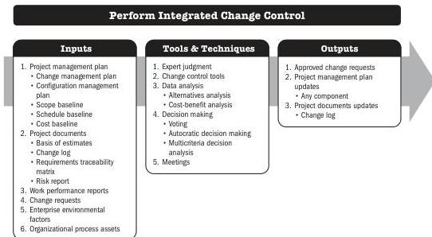

This process is performed throughout the project. The inputs, tools and techniques, and outputs are shown in Figure 7-3. Figure 7-4 presents the data flow diagram for this process.

Note: This figure provides the inputs, tools and techniques, and outputs that may be used for this process. Descriptions for inputs and outputs appear in Section 9. Descriptions for tools and techniques appear in Section 10.

Figure 7-3. Perform Integrated Change Control: Inputs, Tools & Techniques, and Outputs

166

Process Groups: A Practice Guide

PMI Member benefit licensed to: Segun Fatoki - 4510107. Not for distribution, sale, or reproduction.