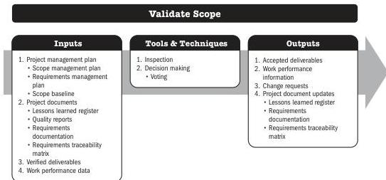

## 7.3 VALIDATE SCOPE

Validate Scope is the process of formalizing acceptance of the completed project deliverables. The key benefit of this process is that it brings objectivity to the acceptance process and increases the probability of final product, service, or result acceptance by validating each deliverable.

*This process is performed periodically throughout the project as needed.* The inputs, tools and techniques, and outputs are shown in Figure 7-5. Figure 7-6 presents the data flow diagram for this process.

Note: This figure provides the inputs, tools and techniques, and outputs that may be used for this process. Descriptions for inputs and outputs appear in Section 9. Descriptions for tools and techniques appear in Section 10.

**Figure 7-5. Validate Scope: Inputs, Tools & Techniques, and Outputs**

Monitoring and Controlling Process Group

PMI Member benefit licensed to: Segun Fatoki - 4510107. Not for distribution, sale, or reproduction.

169