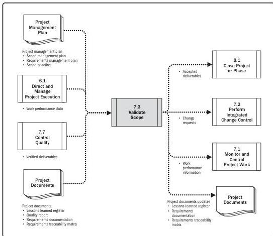

Note: This figure provides the inputs and outputs that may be used for this process.
Descriptions for inputs and outputs appear in Section 9.

**Figure 7-6. Validate Scope: Data Flow Diagram**

The verified deliverables obtained from the Control Quality process are reviewed with the customer or sponsor to ensure they are completed satisfactorily and have received formal acceptance of the deliverables by the customer or sponsor. In this process, the outputs obtained as a result of the Planning processes for scope, such as the requirements documentation or the scope baseline, as well as the work performance data obtained from the Executing processes, are the basis for performing the validation and for final acceptance.

170

Process Groups: A Practice Guide

PMI Member benefit licensed to: Segun Fatoki - 4510107. Not for distribution, sale, or reproduction.