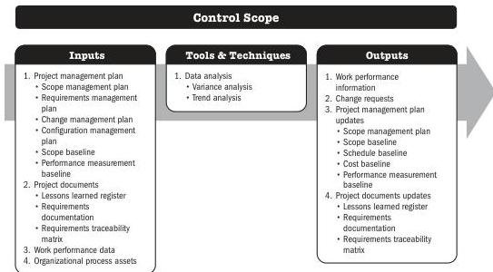

The Validate Scope process is primarily concerned with acceptance of the deliverables while the Control Quality process is primarily concerned with correctness of the deliverables and meeting the quality requirements specified for the deliverables. Control Quality is generally performed before Validate Scope, although the two processes may be performed in parallel.

## 7.4 CONTROL SCOPE

Control Scope is the process of monitoring the status of the project and product scope and managing changes to the scope baseline. The key benefit of this process is that the scope baseline is maintained throughout the project.

*This process is performed throughout the project.* The inputs, tools and techniques, and outputs are shown in Figure 7-7. Figure 7-8 presents the data flow diagram for this process.

Note: This figure provides the inputs, tools and techniques, and outputs that may be used for this process. Descriptions for inputs and outputs appear in Section 9. Descriptions for tools and techniques appear in Section 10.

Figure 7-7. Control Scope: Inputs, Tools & Techniques, and Outputs

Monitoring and Controlling Process Group

PMI Member benefit licensed to: Segun Fatoki - 4510107. Not for distribution, sale, or reproduction.

171