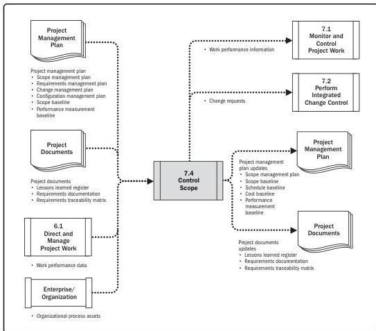

Note: This figure provides the inputs and outputs that may be used for this process.
Descriptions for inputs and outputs appear in Section 9.

**Figure 7-8. Control Scope: Data Flow Diagram**

Controlling the project scope ensures all requested changes and recommended corrective or preventive actions are processed through the Perform Integrated Change Control process (see Section 7.2). Control Scope is also used to manage the actual changes when they occur and is integrated with the other control processes. The uncontrolled expansion to product or project scope without adjustments to time, cost, and resources is referred to as scope creep. Change is inevitable; therefore, some type of change control process is mandatory for every project.

172

Process Groups: A Practice Guide

PMI Member benefit licensed to: Segun Fatoki - 4510107. Not for distribution, sale, or reproduction.